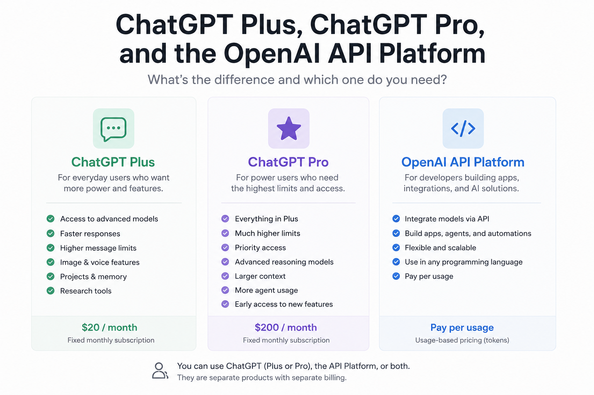

Artificial intelligence tools are becoming part of everyday work for developers, students, researchers, content creators, and businesses. One of the most common points of confusion is the difference between ChatGPT subscriptions and the OpenAI API platform.

Many users assume that paying for ChatGPT automatically gives them access to the API. Others think the API is simply another version of ChatGPT. In reality, these are separate products designed for different purposes.

This article explains the differences between ChatGPT Plus, ChatGPT Pro, and platform.openai.com in a practical way.

# What Is ChatGPT?

[ChatGPT](https://chatgpt.com) is the consumer product created by [OpenAI](https://openai.com). It provides a ready to use interface where users can interact with AI models through a browser or mobile app.

You simply open the application and start chatting with the model.

ChatGPT is designed for:
- Conversations
- Coding help
- Writing
- Research
- Brainstorming
- Image generation
- Voice interaction
- Productivity tasks

The subscription tiers inside ChatGPT mainly affect usage limits, performance, and access to advanced features.


# What Is ChatGPT Plus?

[ChatGPT Plus Pricing](https://chatgpt.com/pricing)

ChatGPT Plus is the standard premium subscription for individual users.

It is aimed at people who use AI regularly and want better access than the free plan provides.

Typical benefits include:
- Access to more advanced models
- Faster responses
- Higher message limits
- Image generation features
- Voice capabilities
- Projects and memory features
- Access to advanced research tools

Plus is ideal for:
- Software engineers
- Students
- Writers
- Designers
- Knowledge workers
- Daily AI users

For many people, Plus is enough to replace multiple productivity tools.


# What Is ChatGPT Pro?

[ChatGPT Pro Information](https://chatgpt.com/pricing)

ChatGPT Pro is designed for heavy users and professional workflows.

While Plus focuses on enhanced everyday usage, Pro targets users who rely on AI throughout the entire workday.

Pro generally includes:
- Much higher usage limits
- Priority access during high demand
- More advanced reasoning models
- Larger context capabilities
- Increased agent and automation usage
- Faster access to newly released features

Typical Pro users include:
- Senior engineers
- Researchers
- AI consultants
- Startup founders
- Technical leads
- Content teams using AI at scale

A useful way to think about it is:

- Plus improves your experience using ChatGPT
- Pro turns ChatGPT into a professional productivity environment

# What Is platform.openai.com?

[OpenAI API Platform](https://platform.openai.com) is not a chat application.

It is a developer platform that allows applications, services, and scripts to communicate directly with OpenAI models through APIs.

Instead of chatting manually through a web interface, developers send requests programmatically.

For example, a backend service can:
- Generate text
- Analyze documents
- Create embeddings
- Build AI agents
- Process voice input
- Generate images
- Automate workflows

A simple API request might look like this:

```python
from openai import OpenAI

client = OpenAI()

response = client.responses.create(
    model="gpt-5.5",
    input="Explain Kubernetes in simple terms"
)

print(response.output_text)
````

The API platform is intended for building products and systems rather than direct human interaction.

# The Biggest Difference

The most important distinction is this:

ChatGPT subscriptions and the API platform are separate systems.

Paying for ChatGPT Plus or Pro does not include API credits.

Likewise, paying for API usage does not automatically give you ChatGPT Plus or Pro access.

This misunderstanding is extremely common among developers who are just entering the AI ecosystem.

# Billing Differences

## ChatGPT Plus and Pro

ChatGPT subscriptions use fixed monthly pricing.

You pay a recurring fee and receive access based on your plan.

This model is similar to streaming subscriptions or SaaS productivity tools.

## OpenAI API Platform

The API platform uses usage based billing.

You pay for:

* Input tokens
* Output tokens
* Image generation
* Audio processing
* Model usage

Costs depend entirely on how much your application uses the models.

A tiny script may cost almost nothing.
A large scale AI product can generate significant monthly costs.

[OpenAI API Pricing](https://openai.com/api/pricing/)

# Which One Should Developers Use?

The answer is usually both.

## Use ChatGPT Plus or Pro for:

* Brainstorming
* Architecture discussions
* Learning
* Coding assistance
* Reviewing pull requests
* Writing documentation
* Fast experimentation

## Use the API Platform for:

* Building applications
* AI agents
* Automations
* Internal company tools
* SaaS products
* MCP servers
* AI integrations in backend systems

For example:

* A Java developer might use ChatGPT to design a Spring Boot architecture
* Then use the API platform to integrate AI into the actual application

# Real World Examples

## Example 1: Personal Productivity

A user subscribes to ChatGPT Plus and uses it daily for:

* Writing emails
* Learning Dutch
* Debugging code
* Planning tasks
* Summarizing documents

No programming is required.

## Example 2: Building an AI Assistant

A developer creates:

* A voice assistant
* A customer support chatbot
* A notification system
* An AI coding agent

This requires the API platform because the software itself must communicate with OpenAI models programmatically.

## Example 3: Enterprise AI Integration

A company integrates AI into:

* Internal dashboards
* Customer communication systems
* Automated reporting
* Document processing pipelines

Again, this uses the API platform rather than the ChatGPT application itself.

# Do You Need Both?

Many technical users eventually use both products together.

A common workflow looks like this:

1. Use ChatGPT to think, design, and experiment
2. Use the API platform to build production systems

This combination is becoming increasingly common in software engineering teams adopting AI assisted development practices.

# Final Thoughts

ChatGPT Plus and Pro are productivity subscriptions designed for humans using AI directly through an interface.

The OpenAI API platform is an infrastructure product designed for developers building AI powered systems.

One is about using AI.
The other is about building with AI.

Understanding this distinction helps users choose the right tool, avoid billing confusion, and build more effective AI workflows.
