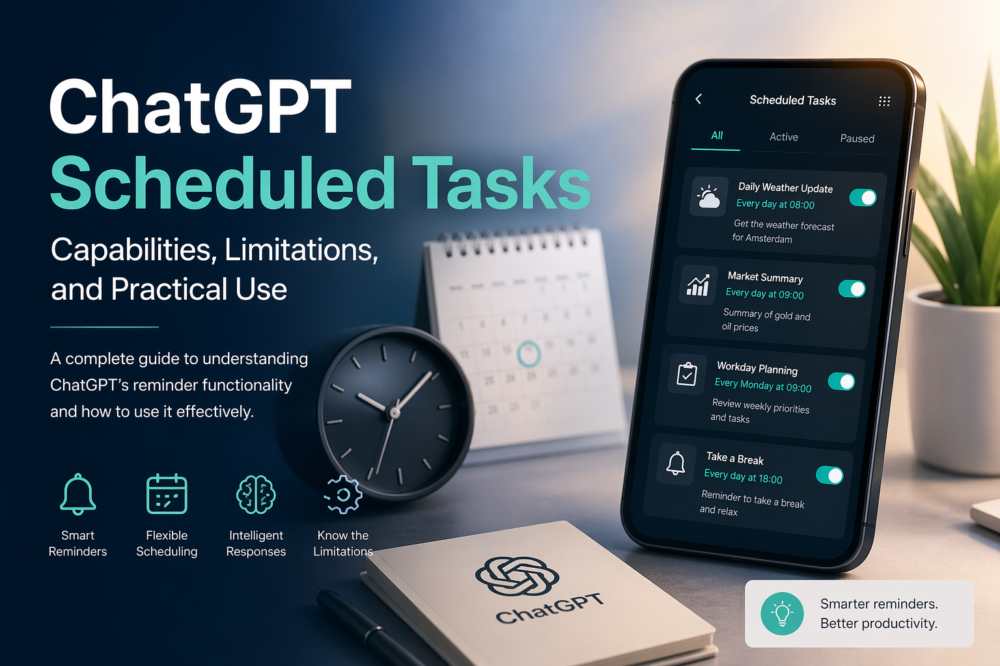

## Introduction

ChatGPT includes a scheduled reminder feature that allows users to create time-based prompts and receive notifications when those prompts are executed. While this capability is useful for personal productivity and lightweight workflows, it is often misunderstood as a full automation or job scheduling system. This article clarifies how the feature works, what it can and cannot do, and how it can be used effectively.

## What the Feature Does

The scheduled tasks feature enables users to define reminders that trigger at a specific time or on a recurring schedule. Each task consists of:

**Title**: A short description of the reminder

**Prompt**: The instruction ChatGPT will execute at runtime

**Schedule**: A one-time or recurring time configuration

When the scheduled time is reached, ChatGPT sends a notification and executes the prompt, generating a response based on the instruction. For example, a user can request:

**A daily reminder to check the weather**

**A weekly summary of tasks**

**A one-time notification to perform a specific action**

This makes ChatGPT more than a passive assistant. It becomes a proactive tool that can deliver context-aware information at the right moment.

**Key Strengths**

1. Persistent Notifications

Reminders are delivered even if the user closes the application, provided notifications are enabled. This allows ChatGPT to function similarly to a personal assistant that follows the user across sessions.

2. Intelligent Output

Unlike traditional reminders, ChatGPT can execute a prompt and generate meaningful output at runtime. For instance, instead of simply reminding a user to check the weather, it can retrieve and summarize the current forecast.

3. Flexible Scheduling

Users can define both one-time and recurring tasks, such as daily or weekly reminders. This supports a wide range of personal productivity scenarios.

Limitations

Despite its usefulness, the feature has several important constraints:

1. Not a Background Execution Engine

ChatGPT does not run continuous background processes. It cannot function as a replacement for server-side schedulers such as cron jobs or enterprise job orchestration systems.

2. No Native External Integrations

The system cannot directly interact with external services such as email platforms, document storage, or third-party APIs without user interaction. For example, it cannot automatically send emails or monitor changes in a document.

3. Frequency Restrictions

Tasks cannot be scheduled at very high frequency. The system limits execution to a maximum of four times per hour.

4. Task Capacity Limit

Users can maintain up to **ten active scheduled tasks at a time**. Completed one-time tasks are removed from this count.

**Mobile vs. Web Experience**

A key usability detail is the difference between platforms:

**Mobile (iOS/Android):**
 Users can create tasks and receive notifications, but there is currently no centralized interface to view and manage all scheduled tasks.

**Web (Desktop):**

 A dedicated management interface is available under Settings, allowing users to view, edit, pause, or delete tasks in one place.

This discrepancy can lead to confusion, as tasks remain active on mobile even though they are not easily visible.

**Practical Use Cases**

The feature is best suited for personal productivity and informational reminders. Examples include:

**Daily weather updates**

**Workday start or end reminders**

**Regular check-ins for tasks or meetings**

**Lightweight information retrieval, such as market summaries**

It also supports semi-automated workflows. For instance, a reminder can prompt the user to trigger a more complex request, such as generating a market report with current data.

## When Additional Tools Are Needed

For fully automated workflows, such as generating reports and sending them via email without user interaction, external systems are required. Tools like Zapier or Make (Integromat) can be combined with backend schedulers and APIs to build complete automation pipelines. In such architectures, ChatGPT serves as the intelligence layer rather than the execution engine.

## Conclusion

The scheduled tasks feature in ChatGPT fills an important gap between simple reminders and complex automation systems. It offers intelligent, time-based notifications that can deliver useful information when needed. However, it is not designed to replace backend schedulers or fully automated workflows.
Used appropriately, it provides a practical and efficient way to enhance daily productivity with minimal setup.
