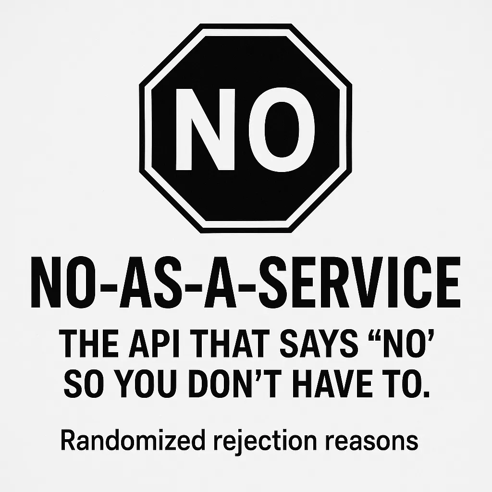

In the ever-expanding universe of APIs, where services range from the highly practical to the delightfully absurd, No-as-a-Service (NAAS) stands out as a whimsical tool designed to deliver randomized rejection reasons. Whether you’re seeking a humorous touch for your applications or a creative way to decline, NAAS offers a unique solution.

🧠 What Is No-as-a-Service?

No-as-a-Service is a lightweight API that, upon receiving a GET request, responds with a JSON object containing a randomly selected rejection reason. These reasons range from the humorous to the relatable, making it a versatile tool for various applications.

Example Response:

{ "reason": "This feels like something Future Me would yell at Present Me for agreeing to." }
You can access the API at https://naas.isalman.dev/no. It’s perfect for adding a touch of humor to your apps, bots, or even as a creative placeholder during development.

⚙️ How to Use It

Using NAAS is straightforward:

curl https://naas.isalman.dev/no
Rate Limiting: To ensure fair usage, the API enforces a rate limit of 10 requests per minute per IP address.

**Why Use No-as-a-Service?**

NAAS is more than just a novelty; it serves multiple purposes:

Customization: Self-host and modify the rejection reasons to suit your needs.

Humor: Add a lighthearted touch to your applications.

Placeholders: Use as a temporary response during development.

Educational: Demonstrates API creation and deployment.

🔗 Explore More

GitHub Repository: https://github.com/hotheadhacker/no-as-a-service

Live API Endpoint: https://naas.isalman.dev/no